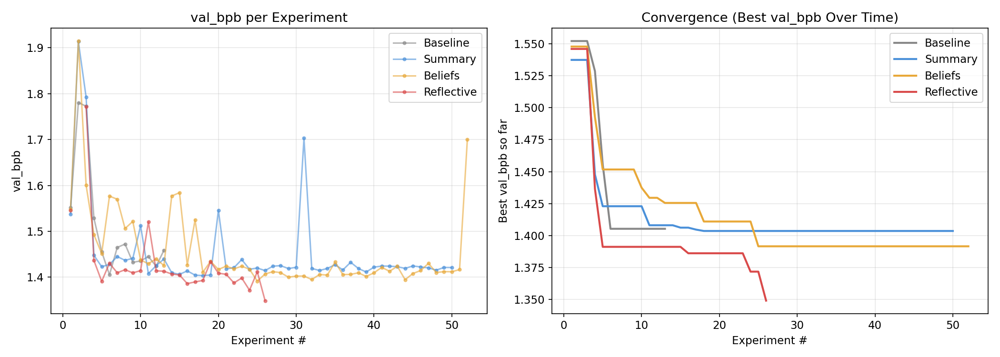
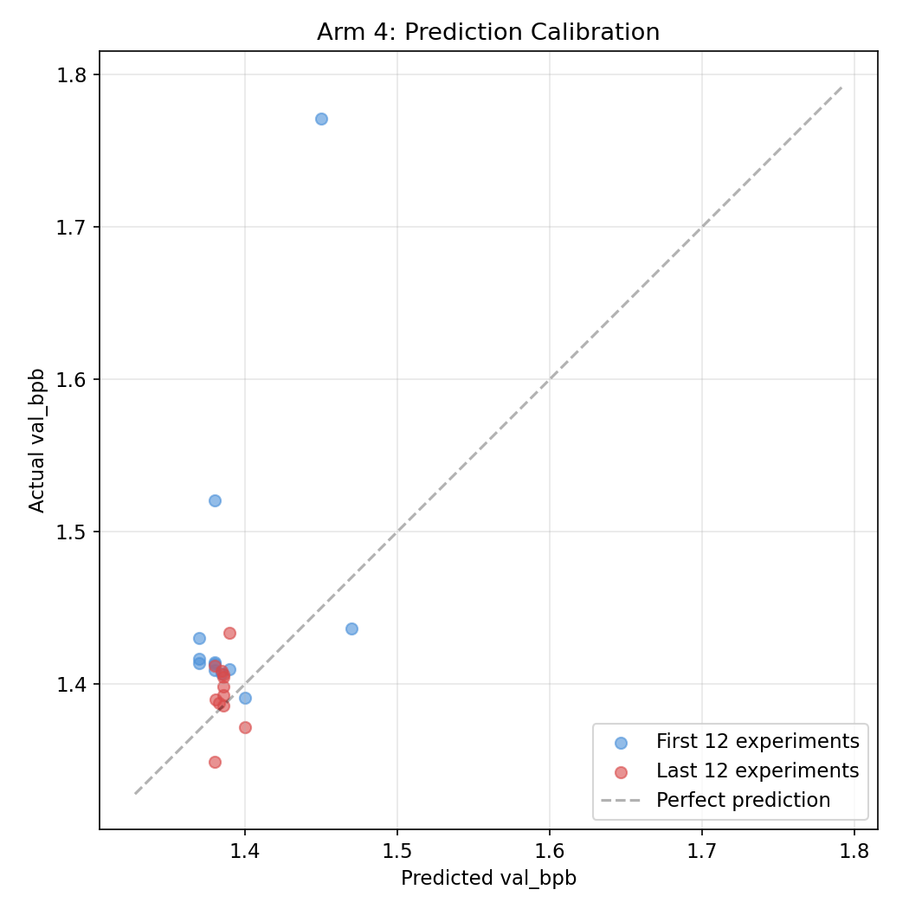
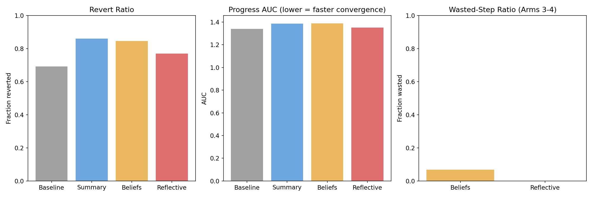

# Reflective Autoresearch

Does giving an AI research agent structured self-reflection make it a better researcher?



## Background

[autoresearch](https://github.com/karpathy/autoresearch) gives an AI agent a small LLM training setup and lets it experiment autonomously. The agent modifies `train.py`, trains for 5 minutes, checks if val_bpb improved, keeps or discards, and repeats. The "program" the agent follows is a Markdown file — the only thing the human writes.

This repo asks: **what if we give the agent better cognitive scaffolding?** We test 4 different `program.md` variants (arms) that add increasing levels of self-reflection to the agent's research loop.

The working hypothesis: forcing explicit predictions makes the agent expose its internal assumptions, and attribution turns failed runs into belief updates rather than just logs.

## The 4 Arms

| Arm | Program | What it adds |
|-----|---------|-------------|
| **1 — Baseline** | `program_baseline.md` | Vanilla loop: edit, train, keep/discard |
| **2 — Summary** | `program_summary.md` | + Running text summary of what worked and what didn't |
| **3 — Beliefs** | `program_beliefs.md` | + Structured beliefs with confidence levels, updated after each experiment |
| **4 — Reflective** | `program_reflective.md` | + Beliefs + predictions before each run + post-hoc reflection when predictions are wrong |

Each arm starts from the same codebase, same hardware (Apple Silicon MPS), same starting `train.py`.

## Results

| Arm | Best val_bpb | Experiments | Key discoveries |
|-----|-------------|-------------|-----------------|
| 1 — Baseline | 1.405 | 25 | Batch 8K |
| 2 — Summary | 1.404 | 50 | Batch 16K, warmdown 0.3, 8x MLP |
| 3 — Beliefs | 1.392 | 52 | Matrix LR 0.12, GELU activation |
| 4 — Reflective | 1.349 | 26 | Batch 16K, no softcap, depth=3 |

Arm 4 reached a better config in fewer trials. Arms 2 and 3 ran longer but didn't reach the same level. The uneven experiment counts are a limitation — ideally each arm would run the same number.

The reflective agent discovered that reducing model depth from 4 to 3 gives more training steps in the fixed 5-minute budget. This hypothesis did not emerge in the other arms over the runs shown.

Prediction calibration appeared to improve over the run. Measuring gap as |predicted − actual| val_bpb: first-half mean 0.066, second-half 0.019 (n=26, so treat as suggestive).





### Observations

- **Reflective > Beliefs > Summary ≈ Baseline** in this setup
- The reflective agent built a causal model of what drives performance (step count matters more than model size on MPS), which led to the depth=3 discovery
- Beliefs alone (Arm 3) helped explore LR space more aggressively and try activation swaps, but plateaued
- Summaries without structured beliefs (Arm 2) performed nearly identically to no scaffolding at all — unstructured text memory didn't help much in this case

**Caveat:** This is a single run on one hardware setup (MPS). Results may differ on CUDA/H100 where throughput dynamics are different. More runs are needed to confirm the pattern.

## Reproducing

**Requirements:** Apple Silicon Mac, Python 3.10+, [uv](https://docs.astral.sh/uv/).

```bash
# One-time setup
uv sync
uv run prepare.py

# Launch an arm (e.g., arm 4)
./run_experiment.sh 4 25

# Follow the instructions it prints — opens a Claude Code session
# that runs autonomously for ~2.5 hours

# After all arms finish, copy results TSVs here and run:
python analyze.py
```

## Repo structure

```
program_baseline.md     — Arm 1: vanilla experiment loop
program_summary.md      — Arm 2: + running summary
program_beliefs.md      — Arm 3: + structured beliefs
program_reflective.md   — Arm 4: + predictions + reflection
beliefs_seed.md         — Initial beliefs for Arms 3-4
run_experiment.sh       — Sets up isolated git worktree per arm
analyze.py              — Generates comparison charts from result TSVs
prepare.py              — Data prep + eval (do not modify)
train.py                — Model + training loop (agent modifies this)
results_arm{1-4}.tsv    — Raw experiment results
```

## Based on

- [karpathy/autoresearch](https://github.com/karpathy/autoresearch) — original concept
- [miolini/autoresearch-macos](https://github.com/miolini/autoresearch-macos) — macOS/MPS fork used as the base

## License

MIT
